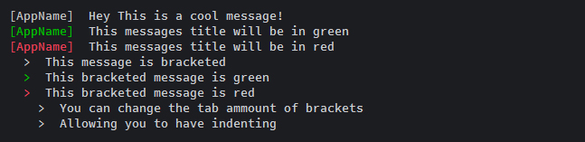

# sout.js

A simple Chalk container package.

Example useage:
```javascript
const sout   = require('sout-js');
const msgApp = new sout('AppName');


msgApp.log('Hey This is a cool message!');
msgApp.log('This messages title will be in green','green');
msgApp.log('This messages title will be in red','red');
msgApp.bracket('This message is bracketed');
msgApp.bracket('This bracketed message is green','green');
msgApp.bracket('This bracketed message is red','red');
msgApp.bracket('You can change the tab amount of brackets','',1);
msgApp.bracket('Allowing you to have indenting','',1);
```
Output:



### Requires:
| Module  | Version |
| ------------- | ------------- |
| [Chalk](https://www.npmjs.com/package/chalk)  | ^1.1.1  |

### Settings:
You can change the tab itself. This is great if you want much bigger tabs, or smaller tabs. It gives you options.

`msgApp.tab = '   '`

---

*Pro tip:* You can indent a whole object of messages,
 do this when your creating creating a `new sout()`
```javascript
const msgApp = new sout('AppName', 1);
```
---


#### To do:
| Task  | Progress |
| ------------- | ------------- |
| Remove Giant objects </br> of possible colors.  | Done!  |
| Load bar timer like npm  | on the table  |
| Integrate A simple timer  | possibility  |

###### Road map:
- [x] Allow use of full `chalk.styles` object
- [x] minimize code footprint
- [x] give option of changing tab size.
- [ ] create a kick-ass load bar replica, similar to npm's load bar
- [ ] Make sout.js public!
